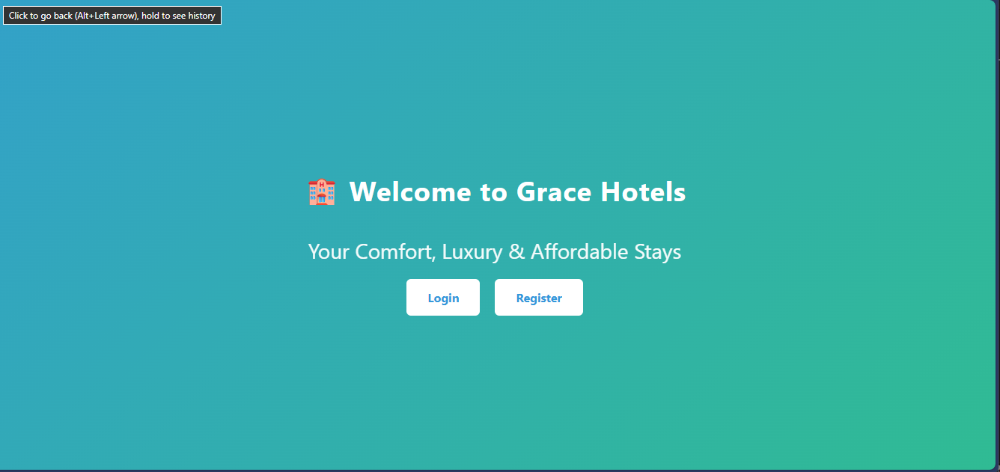
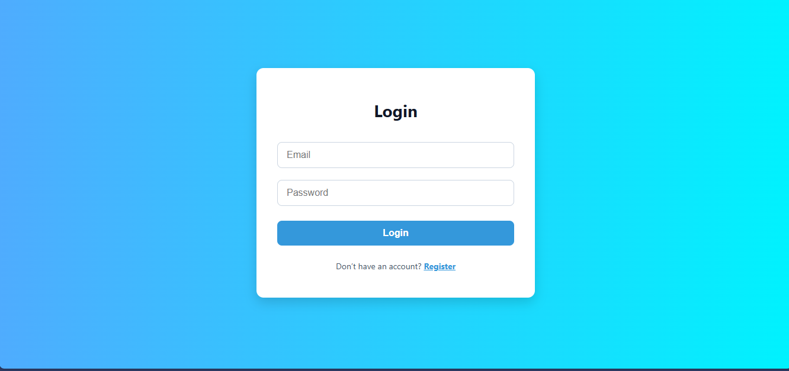
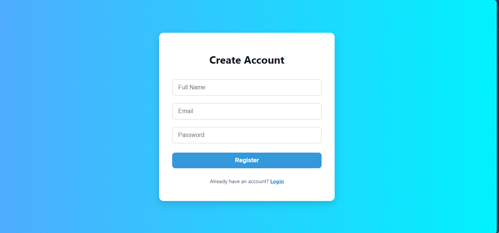
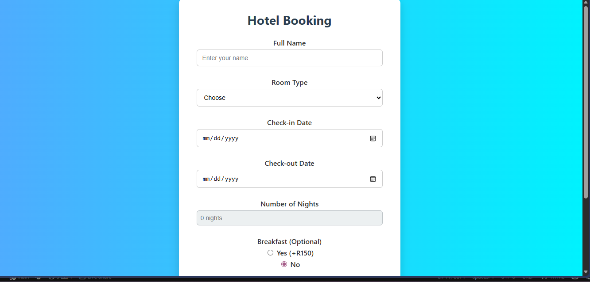
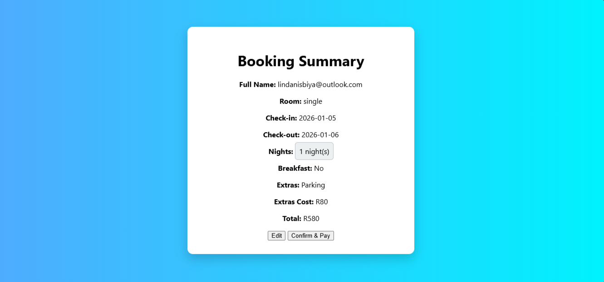
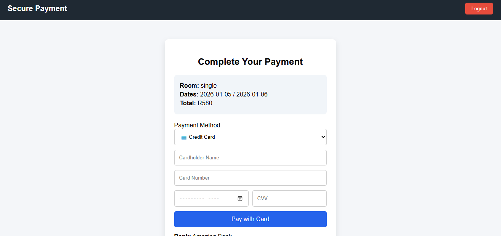
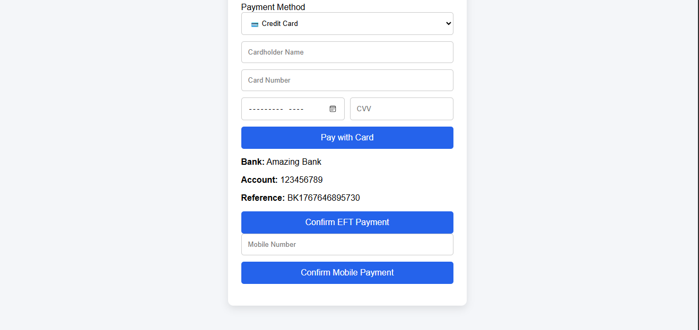
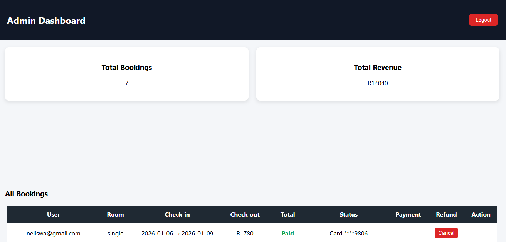
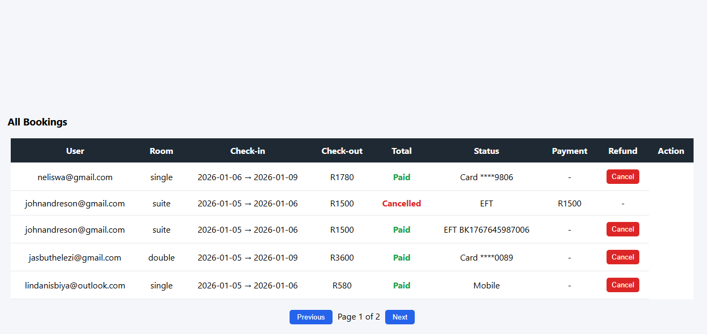
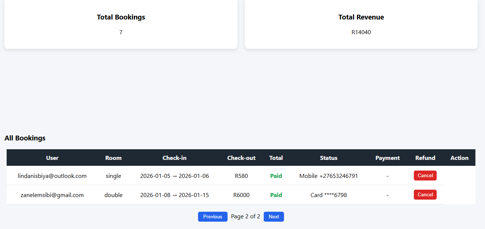

# Hotel Booking System

A responsive, multi-page **hotel booking web application** built with HTML, CSS, and JavaScript. Users can browse rooms, select check-in and check-out dates, view booking summaries, and manage their bookings. Admins have a secure dashboard to manage bookings and user data. All data is stored locally using LocalStorage.

---

## Tech Stack
- HTML5
- CSS3 (Flexbox & Grid for responsive layouts)
- Vanilla JavaScript (ES6+)
- LocalStorage for client-side data persistence

---

## Key Features
- Browse available rooms with date validation
- View booking summary before payment
- User-specific **My Bookings** page
- Role-based access control (User & Admin)
- Admin dashboard to manage bookings and users
- Responsive design for desktop and mobile

---

## User Features
- Register and log in as a user
- Browse hotel rooms and select dates
- View booking summary before confirming payment
- Access **My Bookings** to track current and past bookings
- User-specific access control prevents unauthorized access

---

## Admin Features
- Secure admin login
- Admin dashboard overview
- View and manage all booking data
- Restricted access ensures admin-only pages

---

## What I Worked On
- Designed and implemented the complete booking workflow
- Built responsive layouts using modern CSS
- Implemented client-side validation with JavaScript
- Managed booking and session data using LocalStorage
- Created role-based navigation and access logic
- Developed separate dashboards for users and admins

---

## Screenshots

### Home Page

### Authentication

### Booking Flow

### My Bookings (User Only)

### Admin Dashboard

---

## Live Demo
Check out the live project here: [Hotel Booking System]( https://neliswa14-afk.github.io/hotel-booking-system/)

## How to Run the Project
1. Clone the repository:  
   `git clone <repository-url>`
2. Navigate to the project folder
3. Open `index.html` in any modern web browser
4. Register or log in to explore user or admin features

---

## Project Structure

/hotel-booking-system
│── css/
│── js/
│── screenshots/
│── welcome.html
│── login.html
│── register.html
│── booking.html
│── booking-summary.html
│── my-bookings.html
│── payment.html
│── admin.html
│── README.md

